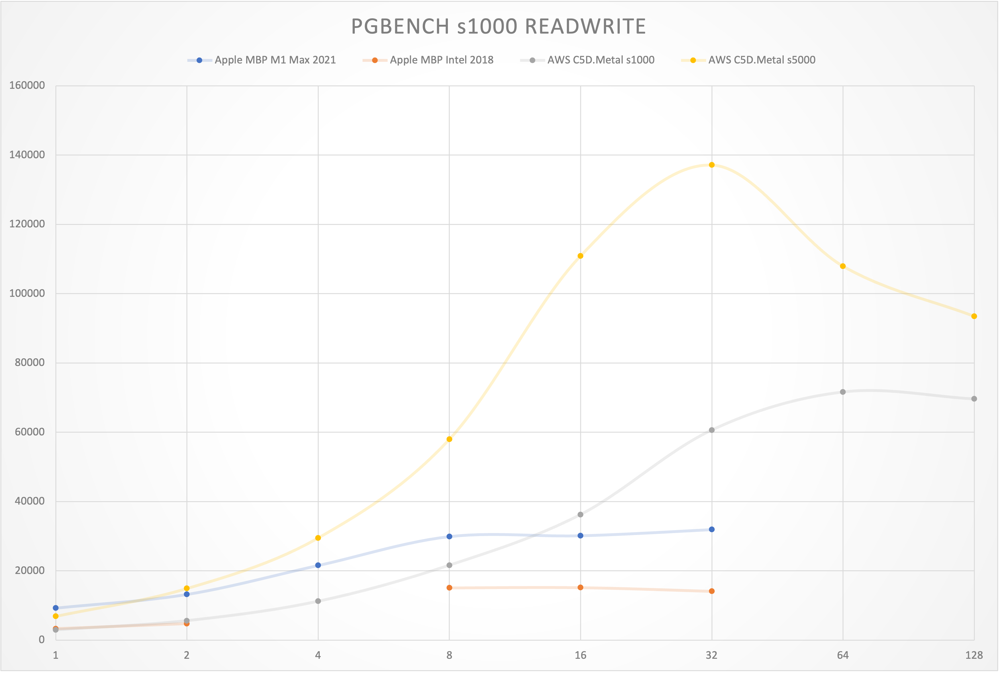
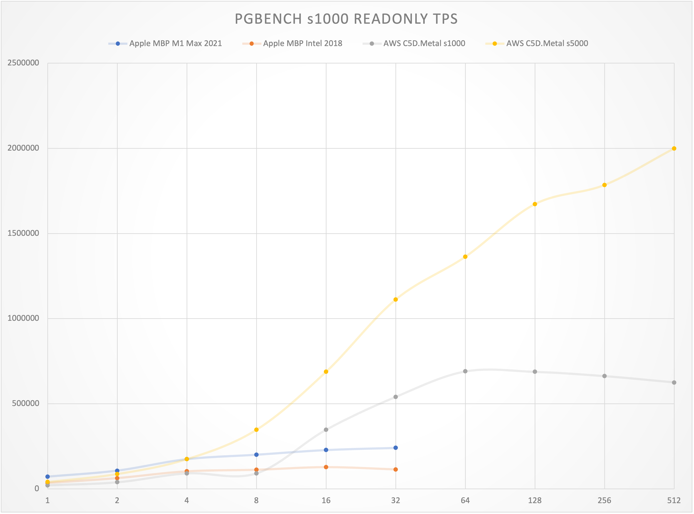
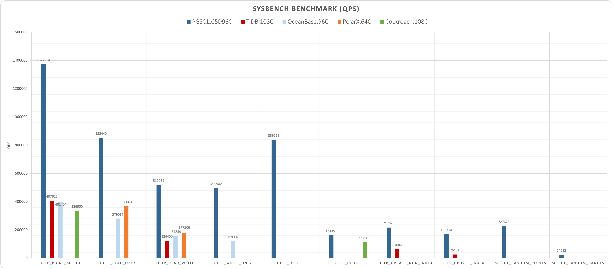
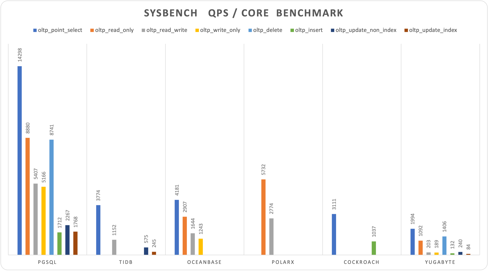
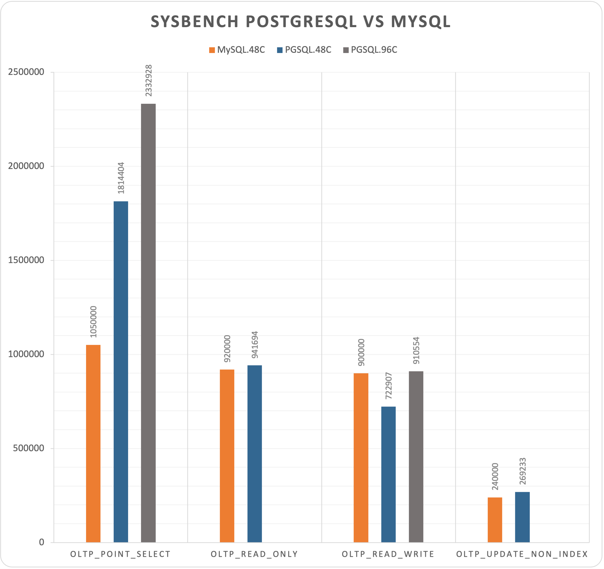
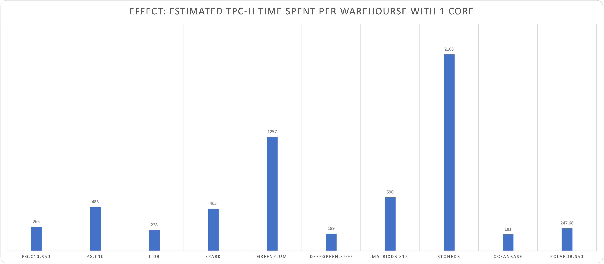

# How fast can PostgreSQL go?

> Figures, Numbers, Benchmarks about how fast can PostgreSQL go!

* https://github.com/Vonng/pgtpc
* [pgbench](pgbench/)： Meaure PostgreSQL performence on different hardwares.
* [sysbench](sysbench/)：Compare PostgreSQL performence with MySQL & other databases
* [tpc-h](tpch/)：Measure PostgreSQL Analysis performence and compare to other AP systems

* Author: [Vonng](https://github.com/Vonng)

### PGBENCH

PostgreSQL have marvelous OTLP performence measured with pgbench (TPC-B Like).

Record: 2M point select QPS, 137K write TPS (1 Xact = 5 Queries / USUUI )  

#### PGBENCH READ WRITE TPS

| RW TPS                | 1    | 2     | 4     | 8     | 16     | 32     | 64     | 128   |
| --------------------- | ---- | ----- | ----- | ----- | ------ | ------ | ------ | ----- |
| Apple MBP M1 Max 2021 | 9254 | 13201 | 21549 | 29882 | 30130  | 31903  |        |       |
| Apple MBP Intel 2018  | 3301 | 4757  |       | 15067 | 15141  | 14075  |        |       |
| AWS C5D.Metal s1000   | 2947 | 5602  | 11199 | 21607 | 36237  | 60636  | 71624  | 69629 |
| AWS C5D.Metal s5000   | 6864 | 14904 | 29481 | 57959 | 110893 | 137127 | 107960 | 93477 |

#### PGBENCH READ-ONLY TPS

| RO TPS                | 1     | 2      | 4      | 8      | 16     | 32      | 64      | 128     | 256     | 512     |
| --------------------- | ----- | ------ | ------ | ------ | ------ | ------- | ------- | ------- | ------- | ------- |
| Apple MBP M1 Max 2021 | 71748 | 107309 | 174629 | 200917 | 228209 | 240841  |         |         |         |         |
| Apple MBP Intel 2018  | 34715 | 63141  | 102741 | 112033 | 127438 | 113870  |         |         |         |         |
| AWS C5D.Metal s1000   | 21583 | 39309  | 91535  | 91535  | 347259 | 540355  | 689821  | 687448  | 662552  | 625849  |
| AWS C5D.Metal s5000   | 40284 | 87247  | 174382 | 346922 | 687244 | 1111431 | 1362714 | 1671769 | 1784125 | 1998580 |

## SYSBENCH 

PGSQL has a similar write performance and significantly better read performance to MySQL.

PGSQL & MYSQL both overwhelm several "Distributed Databases".

|       Database        |              PGSQL.C5D96C               |                          TiDB.108C                           |                        OceanBase.96C                         |                          PolarX.64C                          |                          Cockroach                           |                           Yugabyte                           |
| :-------------------: | :-------------------------------------: | :----------------------------------------------------------: | :----------------------------------------------------------: | :----------------------------------------------------------: | :----------------------------------------------------------: | :----------------------------------------------------------: |
|   oltp_point_select   |                 1372654                 |                            407625                            |                            401404                            |                                                              |                            336000                            |                            95695                             |
|    oltp_read_only     |                 852440                  |                                                              |                            279067                            |                            366863                            |                                                              |                            52416                             |
|    oltp_read_write    |                 519069                  |                            124460                            |                            157859                            |                            177506                            |                                                              |                             9740                             |
|    oltp_write_only    |                 495942                  |                                                              |                            119307                            |                                                              |                                                              |                             9090                             |
|      oltp_delete      |                 839153                  |                                                              |                                                              |                                                              |                                                              |                            67499                             |
|      oltp_insert      |                 164351                  |                                                              |                                                              |                                                              |                            112000                            |                             6348                             |
| oltp_update_non_index |                 217626                  |                            62084                             |                                                              |                                                              |                                                              |                            11496                             |
|   oltp_update_index   |                 169714                  |                            26431                             |                                                              |                                                              |                                                              |                             4052                             |
| select_random_points  |                 227623                  |                                                              |                                                              |                                                              |                                                              |                                                              |
| select_random_ranges  |                  24632                  |                                                              |                                                              |                                                              |                                                              |                                                              |
|        Machine        |                c5d.metal                |       m5.xlarge x3     i3.4xlarge x3     c5.4xlarge x3       |         ecs.hfg7.8xlarge x3     ecs.hfg7.8xlarge x1          |                          Enterprise                          |                        c5d.9xlarge x3                        |                        c5.4xlarge x3                         |
|         Spec          |                96C 192G                 |                          108C 510G                           |                           96C 384G                           |                           64C 256G                           |                          108C 216G                           |                           48C 96G                            |
|         Table         |                16 x 10M                 |                           16 x 10M                           |                           30 x 10M                           |                           1 x 160M                           |                             N/A                              |                          10 x 0.1M                           |
|          CPU          |                   96                    |                             108                              |                              96                              |                              64                              |                             108                              |                              48                              |
|        Source         | [Vonng](https://github.com/Vonng/pgtpc) | [TiDB](https://docs.pingcap.com/tidb/stable/benchmark-sysbench-v6.1.0-vs-v6.0.0) | [OceanBase](https://www.oceanbase.com/docs/community/observer-cn/V3.1.4/10000000000450311) | [PolarDB](https://help.aliyun.com/document_detail/139562.html) | [Cockroach](https://www.cockroachlabs.com/docs/stable/performance.html) | [YugaByte](https://docs.yugabyte.com/preview/benchmark/sysbench-ysql/) |

### Sysbench: Fair Play

If we normalize QPS performence with CPU cores used, it will be like:

|       Testcase        | PGSQL | TiDB | OceanBase | PolarX | Cockroach | Yugabyte |
| :-------------------: | ----- | :--: | :-------: | :----: | :-------: | :------: |
|   oltp_point_select   | 14298 | 3774 |   4181    |        |   3111    |   1994   |
|    oltp_read_only     | 8880  |      |   2907    |  5732  |           |   1092   |
|    oltp_read_write    | 5407  | 1152 |   1644    |  2774  |           |   203    |
|    oltp_write_only    | 5166  |      |   1243    |        |           |   189    |
|      oltp_delete      | 8741  |      |           |        |           |   1406   |
|      oltp_insert      | 1712  |      |           |        |   1037    |   132    |
| oltp_update_non_index | 2267  | 575  |           |        |           |   240    |
|   oltp_update_index   | 1768  | 245  |           |        |           |    84    |

#### References

* [AWS c5d.metal (NORMAL)](sysbench/aws.c5d.metal.normal.md)
* [Reference: TiDB 6.1](sysbench/ref-tidb6.md)
* [Reference: OceanBase 3.1](sysbench/ref-oceanbase3.md)
* [Reference: PolarDB-X](sysbench/ref-polardbx.md)

### SYSBENCH: Dirty Hack

#### PGSQL vs MySQL: OLTP Performence

MySQL Official Site - Why MySQL - Benchmarks - [MySQL 8.0](https://www.mysql.com/why-mysql/benchmarks/mysql/) Have a blantant bench result.

Which turns off checksum, double write, binlog, PFS, and fsync and use latin-1 charset. Which makes it a toy and impossible to use in real-world production environment.

However we can using the same dirty hack in PostgreSQL and see how far it goes.

* [Reference: MySQL](sysbench/ref-mysql.md)
* [AWS c5d.metal (EXTREME)](sysbench/aws.c5d.metal.extreme.md)

#### PGSQL vs MySQL: OLTP Point Select

## TPC-H

PostgreSQL has pretty good OLAP performence / effect comparing to other Ad-hoc AP systems.

PostgreSQL can finish tpc-h50 in 22min, and tpc-h100 in 80min on a 10C laptop.

| Scale Factor | Time (s) | CPU  | Environment |    Comment    |
| :----------: | :------: | :--: | :---------: | :-----------: |
|      1       |    8     |  10  | 10C  / 64G  | apple  m1 max |
|      10      |    56    |  10  | 10C  / 64G  | apple  m1 max |
|      50      |   1327   |  10  | 10C  / 64G  | apple  m1 max |
|     100      |   4835   |  10  | 10C  / 64G  | apple  m1 max |
|      1       |  13.51   |  8   |  8C  / 64G  |  z1d.2xlarge  |
|      10      |  133.35  |  8   |  8C  / 64G  |  z1d.2xlarge  |

#### Comparison

We can measure relative AP effectiveness by normalize CPU core numbers, Scale Factors. Just for a rough references: Effect = Estimated TPC-H Time spent completing 1 Warehouse using 1 Core. 

> Effect = Time / Scale Factor * CPU

| Database   | SF   | Time (s) | CPU  | Environment   | Comment       | Source                                                       | Effect |
| ---------- | ---- | -------- | ---- | ------------- | ------------- | ------------------------------------------------------------ | :----: |
| PostgreSQL | 1    | 8        | 10   | 10C  / 64G    | apple  m1 max | [Vonng](https://github.com/Vonng/pgtpc/tree/master/tpch)     |   80   |
| PostgreSQL | 10   | 56       | 10   | 10C  / 64G    | apple  m1 max | [Vonng](https://github.com/Vonng/pgtpc/tree/master/tpch)     |   56   |
| PostgreSQL | 50   | 1327     | 10   | 10C  / 64G    | apple  m1 max | [Vonng](https://github.com/Vonng/pgtpc/tree/master/tpch)     |  265   |
| PostgreSQL | 100  | 4835     | 10   | 10C  / 64G    | apple  m1 max | [Vonng](https://github.com/Vonng/pgtpc/tree/master/tpch)     |  484   |
| PostgreSQL | 1    | 13.51    | 8    | 8C  / 64G     | z1d.2xlarge   | [Vonng](https://github.com/Vonng/pgtpc/tree/master/tpch)     |  108   |
| PostgreSQL | 10   | 133.35   | 8    | 8C  / 64G     | z1d.2xlarge   | [Vonng](https://github.com/Vonng/pgtpc/tree/master/tpch)     |  107   |
| TiDB       | 100  | 190      | 120  | 120C  / 570G  |               | [TiDB](https://docs.pingcap.com/zh/tidb/v5.2/v5.2-performance-benchmarking-with-tpch) |  228   |
| Spark      | 100  | 388      | 120  | 120C  / 570G  |               | [TiDB](https://docs.pingcap.com/zh/tidb/v5.2/v5.2-performance-benchmarking-with-tpch) |  466   |
| Greenplum  | 100  | 436      | 288  | 120C  / 570G  |               | [TiDB](https://docs.pingcap.com/zh/tidb/v5.2/v5.2-performance-benchmarking-with-tpch) |  1256  |
| DeepGreen  | 200  | 148      | 256  | 288C  / 1152G |               | [Digoal](https://billtian.github.io/digoal.blog/2018/09/03/02.html) |  189   |
| MatrixDB   | 1000 | 2306     | 256  | 256C  / 1024G |               | [MXDB](https://cloud.tencent.com/developer/article/1997622)  |  590   |
| Hive       | 1000 | 59599    | 256  | 256C  / 1024G |               | [MXDB](https://cloud.tencent.com/developer/article/1997622)  | 15257  |
| StoneDB    | 100  | 3388     | 64   | 64C  / 128G   |               | [StoneDB](https://stonedb.io/docs/performance-tuning/performance-tests/OLAP/tcph-test-report) |  2168  |
| ClickHouse | 100  | 11537    | 64   | 64C  / 128G   |               | [StoneDB](https://stonedb.io/docs/performance-tuning/performance-tests/OLAP/tcph-test-report) |  7384  |
| OceanBase  | 100  | 189      | 96   | 96C  / 384G   |               | [OceanBase](https://open.oceanbase.com/docs/community/oceanbase-database/V3.1.0/wtu4kv) |  181   |
| PolarDB    | 50   | 387      | 32   | 32C  / 128G   |               | [Aliyun](https://static-aliyun-doc.oss-cn-hangzhou.aliyuncs.com/download%2Fpdf%2F59748%2F%E6%80%A7%E8%83%BD%E7%99%BD%E7%9A%AE%E4%B9%A6_cn_zh-CN.pdf) |  248   |
| PolarDB    | 50   | 755      | 16   | 16C  / 64G    |               | [Aliyun](https://static-aliyun-doc.oss-cn-hangzhou.aliyuncs.com/download%2Fpdf%2F59748%2F%E6%80%A7%E8%83%BD%E7%99%BD%E7%9A%AE%E4%B9%A6_cn_zh-CN.pdf) |  242   |
