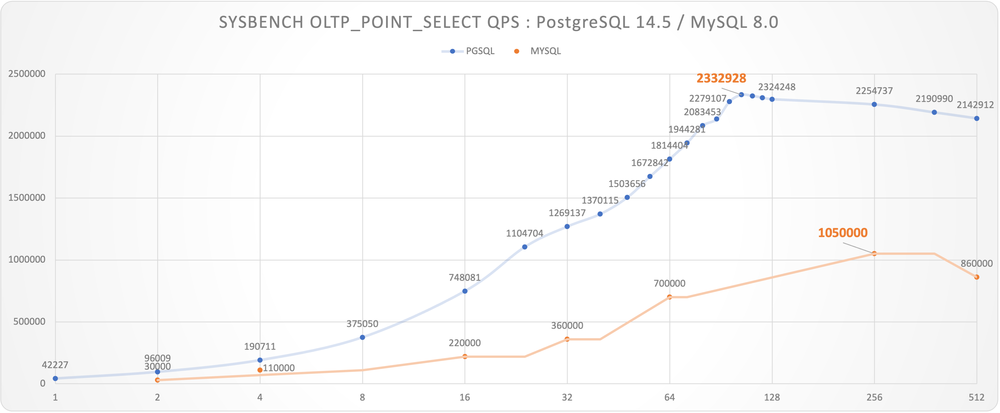

# Benchmark for PostgreSQL

* https://github.com/Vonng/pgtpc
* [pgbench](tpcb/)
* [sysbench](tpcc/)
* [tpc-h](tpch/)

----------------------

## PGBENCH

#### **Read Only**

| RO TPS                | 1     | 2      | 4      | 8      | 16     | 32      | 64      | 128     | 256     | 512     |
| --------------------- | ----- | ------ | ------ | ------ | ------ | ------- | ------- | ------- | ------- | ------- |
| Apple MBP M1 Max 2021 | 71748 | 107309 | 174629 | 200917 | 228209 | 240841  |         |         |         |         |
| Apple MBP Intel 2018  | 34715 | 63141  | 102741 | 112033 | 127438 | 113870  |         |         |         |         |
| AWS C5D.Metal s1000   | 21583 | 39309  | 91535  | 91535  | 347259 | 540355  | 689821  | 687448  | 662552  | 625849  |
| AWS C5D.Metal s5000   | 40284 | 87247  | 174382 | 346922 | 687244 | 1111431 | 1362714 | 1671769 | 1784125 | 1998580 |

#### Read Write

| RW TPS                | 1    | 2     | 4     | 8     | 16     | 32     | 64     | 128   |
| --------------------- | ---- | ----- | ----- | ----- | ------ | ------ | ------ | ----- |
| Apple MBP M1 Max 2021 | 9254 | 13201 | 21549 | 29882 | 30130  | 31903  |        |       |
| Apple MBP Intel 2018  | 3301 | 4757  |       | 15067 | 15141  | 14075  |        |       |
| AWS C5D.Metal s1000   | 2947 | 5602  | 11199 | 21607 | 36237  | 60636  | 71624  | 69629 |
| AWS C5D.Metal s5000   | 6864 | 14904 | 29481 | 57959 | 110893 | 137127 | 107960 | 93477 |

----------------------

## SYSBENCH

|       Database        | PGSQL.C5D96C |                    TiDB.108C                     |                OceanBase.96C                | PolarX.64C | Comment |
| :-------------------: | :----------: | :----------------------------------------------: | :-----------------------------------------: | :--------: | :-----: |
|   oltp_point_select   |   1372654    |                      407625                      |                   401404                    |            |         |
|    oltp_read_only     |    852440    |                                                  |                   279067                    |   366863   | 16x TPS |
|    oltp_read_write    |    519069    |                      124460                      |                   157859                    |   177506   | 20x TPS |
|    oltp_write_only    |    495942    |                                                  |                   119307                    |            | 6x TPS  |
|      oltp_delete      |    839153    |                                                  |                                             |            |         |
|      oltp_insert      |    164351    |                                                  |                                             |            |         |
| oltp_update_non_index |    217626    |                      62084                       |                                             |            |         |
|   oltp_update_index   |    169714    |                      26431                       |                                             |            |         |
| select_random_points  |    227623    |                                                  |                                             |            |         |
| select_random_ranges  |    24632     |                                                  |                                             |            |         |
|        Machine        |  c5d.metal   | m5.xlarge x3     i3.4xlarge x3     c5.4xlarge x3 | ecs.hfg7.8xlarge x3     ecs.hfg7.8xlarge x1 | Enterprise |         |
|         Spec          |   96C 192G   |                    108C 510G                     |                  96C 384G                   |  64C 256G  |         |

#### Sysbench: Comparison

* [AWS c5d.metal (NORMAL)](sysbench/aws.c5d.metal.normal.md)
* [Reference: TiDB 6.1](sysbench/ref-tidb6.md)
* [Reference: OceanBase 3.1](sysbench/ref-oceanbase3.md)
* [Reference: PolarDB-X](sysbench/ref-polardbx.md)

#### Sysbench: PGSQL vs MySQL

* [Reference: MySQL](sysbench/ref-mysql.md)
* [AWS c5d.metal (EXTREME)](sysbench/aws.c5d.metal.extreme.md)

#### OLTP Point Select: PGSQL vs MySQL

-----------------------------

## TPC-H

#### Overview

| Scale Factor | Time (s) | CPU  | Environment |    Comment    |
| :----------: | :------: | :--: | :---------: | :-----------: |
|      1       |    8     |  10  | 10C  / 64G  | apple  m1 max |
|      10      |    56    |  10  | 10C  / 64G  | apple  m1 max |
|      50      |   1327   |  10  | 10C  / 64G  | apple  m1 max |
|     100      |   4835   |  10  | 10C  / 64G  | apple  m1 max |
|      1       |  13.51   |  8   |  8C  / 64G  |  z1d.2xlarge  |
|      10      |  133.35  |  8   |  8C  / 64G  |  z1d.2xlarge  |

#### Comparison

Effect = Estimated TPC-H Time spent completing 1 Warehouse using 1 Core.  (Lower is better)

Effect = Time / Scale Factor * CPU

| Database   | SF   | Time (s) | CPU  | Environment   | Comment       | Source                                                       | Effect |
| ---------- | ---- | -------- | ---- | ------------- | ------------- | ------------------------------------------------------------ | ------ |
| PostgreSQL | 1    | 8        | 10   | 10C  / 64G    | apple  m1 max | [Vonng](https://github.com/Vonng/pgtpc/tree/master/tpch)     | 80     |
| PostgreSQL | 10   | 56       | 10   | 10C  / 64G    | apple  m1 max | [Vonng](https://github.com/Vonng/pgtpc/tree/master/tpch)     | 56     |
| PostgreSQL | 50   | 1327     | 10   | 10C  / 64G    | apple  m1 max | [Vonng](https://github.com/Vonng/pgtpc/tree/master/tpch)     | 265    |
| PostgreSQL | 100  | 4835     | 10   | 10C  / 64G    | apple  m1 max | [Vonng](https://github.com/Vonng/pgtpc/tree/master/tpch)     | 484    |
| PostgreSQL | 1    | 13.51    | 8    | 8C  / 64G     | z1d.2xlarge   | [Vonng](https://github.com/Vonng/pgtpc/tree/master/tpch)     | 108    |
| PostgreSQL | 10   | 133.35   | 8    | 8C  / 64G     | z1d.2xlarge   | [Vonng](https://github.com/Vonng/pgtpc/tree/master/tpch)     | 107    |
| TiDB       | 100  | 190      | 120  | 120C  / 570G  |               | [TiDB](https://docs.pingcap.com/zh/tidb/v5.2/v5.2-performance-benchmarking-with-tpch) | 228    |
| Spark      | 100  | 388      | 120  | 120C  / 570G  |               | [TiDB](https://docs.pingcap.com/zh/tidb/v5.2/v5.2-performance-benchmarking-with-tpch) | 466    |
| Greenplum  | 100  | 436      | 288  | 120C  / 570G  |               | [TiDB](https://docs.pingcap.com/zh/tidb/v5.2/v5.2-performance-benchmarking-with-tpch) | 1256   |
| DeepGreen  | 200  | 148      | 256  | 288C  / 1152G |               | [Digoal](https://billtian.github.io/digoal.blog/2018/09/03/02.html) | 189    |
| MatrixDB   | 1000 | 2306     | 256  | 256C  / 1024G |               | [MXDB](https://cloud.tencent.com/developer/article/1997622)  | 590    |
| Hive       | 1000 | 59599    | 256  | 256C  / 1024G |               | [MXDB](https://cloud.tencent.com/developer/article/1997622)  | 15257  |
| StoneDB    | 100  | 3388     | 64   | 64C  / 128G   |               | [StoneDB](https://stonedb.io/docs/performance-tuning/performance-tests/OLAP/tcph-test-report) | 2168   |
| ClickHouse | 100  | 11537    | 64   | 64C  / 128G   |               | [StoneDB](https://stonedb.io/docs/performance-tuning/performance-tests/OLAP/tcph-test-report) | 7384   |
| OceanBase  | 100  | 189      | 96   | 96C  / 384G   |               | [OceanBase](https://open.oceanbase.com/docs/community/oceanbase-database/V3.1.0/wtu4kv) | 181    |
| PolarDB    | 50   | 387      | 32   | 32C  / 128G   |               | [Aliyun](https://static-aliyun-doc.oss-cn-hangzhou.aliyuncs.com/download%2Fpdf%2F59748%2F%E6%80%A7%E8%83%BD%E7%99%BD%E7%9A%AE%E4%B9%A6_cn_zh-CN.pdf) | 248    |
| PolarDB    | 50   | 755      | 16   | 16C  / 64G    |               | [Aliyun](https://static-aliyun-doc.oss-cn-hangzhou.aliyuncs.com/download%2Fpdf%2F59748%2F%E6%80%A7%E8%83%BD%E7%99%BD%E7%9A%AE%E4%B9%A6_cn_zh-CN.pdf) | 242    |

