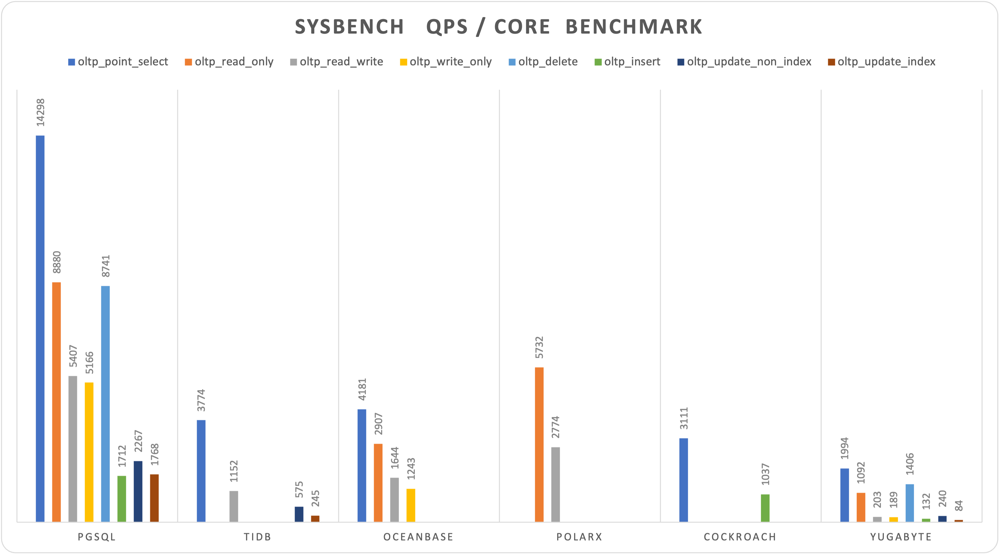

# PostgreSQL到底有多强？

> 用性能数据说话，为什么PostgreSQL是世界上最先进的开源关系型数据库，暨世界上最成功的数据库。

上一次我们通过分析 StackOverflow 的用户调研数据，说明了《[为什么PostgreSQL是最成功的数据库](http://pigsty.cc/zh/blog/2022/07/12/%E4%B8%BA%E4%BB%80%E4%B9%88postgresql%E6%98%AF%E6%9C%80%E6%88%90%E5%8A%9F%E7%9A%84%E6%95%B0%E6%8D%AE%E5%BA%93/)》。

而这一次我们将用性能数据来说话，聊聊最成功的 PostgreSQL 到底有多强，帮助大家做到“心中有数”。

## 太长不看

如果您对以下这些问题有兴趣，那么本文会对您有所帮助：

* PostgreSQL 到底性能有多强？

  点查 QPS 60万+，最高达 200 万。读写 TPS （4写1读）每秒 7 万+，最高达14万。

* PostgreSQL 与 MySQL 的极限性能对比

  极限条件下，PgSQL点查性能显著压倒 MySQL，其他性能基本与MySQL持平。 

* PostgreSQL 与其他数据库的性能对比

   “分布式数据库”/NewSQL 在相同硬件规格下的性能表现显著落后于经典数据库。

* PostgreSQL 与其他分析数据库的 TPC-H 表现。

  PostgreSQL 原生作为一个 HATP 数据库，有比较亮眼的分析表现。

* 云数据库 / 云服务器 的成本到底有没有优势？

  c5d.metal 用1年的价格，可以把服务器买下来托管用5年。对应规格云数据库用1年的价格，可以供你买同样的EC2用20年

详细测试过程与原始数据放置于： https://github.com/Vonng/pgtpc

## PGBENCH

软件与硬件的技术日新月异，尽管性能评测的文章汗牛充栋，却没有多少能反映这些变换。在这项测试中，我们选择了两种新规格硬件，使用 **PGBENCH** 测试了最新的 PostgreSQL 14.5 在这些硬件上的性能表现。

测试的主体包括四种规格的硬件，两台 Apple 笔记本与三台 AWS EC2云服务器，分别是 2018 年使用 Intel 6核 i9芯片的 15寸顶配 Macbook Pro，2021 年使用 M1 MAX 芯片的顶配 16 寸 Macbook Pro ，AWS z1d.2xlarge (8C 64G)，以及 AWS c5d.metal ，这些都是市面上可以轻松买到的商用硬件。

PGBENCH是 PostgreSQL 自带的压测工具，默认使用类 TPC-B 的查询，可用于评估 PostgreSQL 及其兼容版数据库的性能。测试分为两种：只读查询 RO、以及读写 RW。只读查询包含一条 SQL，随机从1亿条数据库中挑选一条查出；而读写事务包含5条SQL语句，一条查询、1条插入与三条更新。测试基于 s=1000 的数据集规模，使用 PGBENCH 逐步增加客户端连接数，找到 QPS / TPS 的极大值点，并记录持续测试 3-5 分钟后的稳定均值，结果如下：

| No   |         Spec          | Config  | CPU  |       Freq       |  S   |   RO    |   RW   |
| ---- | :-------------------: | ------- | ---- | :--------------: | :--: | :-----: | :----: |
| 1    | Apple MBP Intel 2018  | Normal  | 6    | 2.9GHz - 4.8GHz  | 1000 | 113870  | 15141  |
| 2    |    AWS z1d.2xlarge    | Normal  | 8    |       4GHz       | 1000 | 162315  | 24808  |
| 3    | Apple MBP M1 Max 2021 | Normal  | 10   | 600MHz - 3.22GHz | 1000 | 240841  | 31903  |
| 4    |     AWS c5d.metal     | Normal  | 96   |      3.6GHz      | 1000 | 625849  | 71624  |
| 5    |    AWS  c5d.metal     | Extreme | 96   |      3.6GHz      | 5000 | 1998580 | 137127 |

#### Read Write

> 图：各硬件配置下读写 TPS 上限

> 图：各硬件配置下读写 TPS - 并发曲线

#### Read Only

> 图：各硬件配置下点查 QPS 上限

> 图：各硬件配置下点查 QPS - 并发曲线

结果相当令人震惊，在 Apple M1 Max 10C 笔记本上，PG 跑出了 32K 读写，240K 点查的性能水平，在 AWS c5d.metal 生产物理机上，PG 跑出了 72K 读写，630K 点查的性能。使用极限优化压榨，最多可以达到 单机 137K 读写，2M 点查的怪兽级性能。

作为一个粗略的规格参考，探探作为一个前部的互联网App，PostgreSQL 全局 TPS 为 40万左右。这意味着十几台这样的新笔记本，或几台顶配服务器（10W内¥）就有潜力支撑起一个大型互联网应用的数据库服务，这对于以前来说是难以想象的。

#### 关于成本

以宁夏区域，C5D.METAL 机型为例，该机型是目前综合算力最好的物理机，且自带 3.6 TB的本地NVME SSD存储，有7种可选的付费模式：

| 付费模式                      | 月度  |  预付   | 折合每年 |
| ----------------------------- | :---: | :-----: | :------: |
| 按需                          | 31927 |    0    | 383,124  |
| 标准预留，1年，无预付费用     | 12607 |    0    | 151,284  |
| 标准预留，1年，预付部分       | 5401  | 64,540  | 129,352  |
| 标准预留，1年，预付全部费用   |   0   | 126,497 | 126,497  |
| 可转化预留，3年，无预付费用   | 11349 |    0    | 136,188  |
| 可转化预留，3年，预付部分     | 4863  | 174,257 | 116,442  |
| 可转化预留，3年，预付全部费用 |   0   | 341,543 | 113,847  |

折合每年成本在 11万 ～ 15万，零售按需每年成本38万。该机器如果自行购置，IDC托管代维网电五年综合成本应在10万内。尽管看上去云硬件的年化成本高达自建的五倍，但考虑到其灵活性，折扣优惠与抵扣券，AWS EC2 云服务器定价总体仍处于合理范围。使用此类云硬件自建数据库，也有非常优异的性能表现。

但 RDS for PostgreSQL 则完全是另一个故事了，如果您想使用类似规格的云数据库，最接近的规格是 db.m5.24xlarge，96C，384G，配置 3.6T / 80000 IOPS 的 io1存储（c5d.metal 3.6T NVME SSD 8K RW IOPS 大约95K左右，普通 io1 存储最高 IOPS 为 80K），则每月成本为 24万¥，每年成本为286,7630¥ ，**是同规格 EC2 自建的近 20 倍**。

> https://calculator.amazonaws.cn/

## SYSBENCH

PostgreSQL 确实很强，但与其他数据库系统相比则何如？PGBENCH 主要用于评估 PostgreSQL 及其衍生/兼容数据库的性能，但如果需要横向比较不同数据库的性能表现，我们就要用到 SYSBENCH 了。

Sysbench是一款开源、跨平台的多线程数据库性能测试工具，测试结果可以很有代表性地反映一个数据库系统的事务处理能力能力。SYSBENCH 包含了10个典型测试用例，如测试点查性能的 `oltp_point_select`，更新性能的 `oltp_update_index`，综合读写事务性能的 `oltp_read_only` (16条查询一个事务)，`oltp_read_write` （20条混合查询一个事务）与`oltp_write_only` （6条写入SQL）等…。

SYSBENCH 既可以用于测试 MySQL 的性能，也可以用来测试 PgSQL 的性能（当然也包括两者的兼容衍生），因此具有良好的横向可比性。让我们先来看一下最为喜闻乐见的对比，开源关系数据库内战：世界上“最流行”的开源关系型数据库 —— MySQL ， 与世界上最先进的开源关系型数据库 —— PostgreSQL 性能横向对比。

### Dirty Hack

 MySQL 并没有提供一个官方的 SYSBENCH 测试结果，只是在官网上贴出了一个第三方评测结果的图片与链接，不加解释地暗示 MySQL 可以做到 1M 的点查 QPS，240K 的索引键更新，约 39K 的复合读写TPS。

> 图：https://www.mysql.com/why-mysql/benchmarks/mysql/

这是相当不讲武德的行为。因为如果阅览了连接的评测文章就会发现：这是把所有 MySQL 安全特性关闭得到的结果：关闭Binlog，提交刷盘，FSYNC，性能监控，DoubleWrite，校验和，强制使用 LATIN-1 字符集，这样的数据库根本没法用于生产环境，只是为了刷分而刷分。

但反过来说，我们也可以使用这些 Dirty Hack，把对应的 PostgreSQL 安全特性也关闭，也看看 PostgreSQL 的最终极限在哪里？结果相当震撼，PGSQL点查QPS干到了 [233万每秒](https://github.com/Vonng/pgtpc/blob/master/sysbench/c5d.metal.extreme/point-104)，峰值远远甩开 MySQL 一倍还多。

> 图：不讲武德的Benchmar：PgSQL vs MySQL

> PostgreSQL 极限配置下点查压测现场

必须说明的是，MySQL 的bench使用的是 48C 2.7GHz的机器，而PostgreSQL使用的是 96C 3.6GHz 的机器。不过因为PG使用进程模型，我们可以使用 c=48 的测试值作为 PG 在 48C 机器上表现的一个下限近似：对于只读请求，QPS峰值通常在客户端数略大于CPU核数时达到。即便如此，c=48 时PG的点查 QPS（ 150万）仍然比MySQL峰值高了43%。

> 因为我并不是 MySQL 专家，在此也期待 MYSQL 专家基于完全相同的硬件给出测评报告，更好的地进行对比。

> 图：MySQL 有结果的四项 SYSBENCH 结果，c=48

在其他测试上，MySQL 也有不错的极限表现，`otlp_read_only`, `oltp_update_non_index` 都与 PostgreSQL （c=48）接近持平，甚至在 `oltp_read_write` 上还略微超过 PostgreSQL。 

总体来说在极限条件下，PG除了点查上碾压了MySQL，其他测试上性能与 MySQL 基本持平。

### Fair Play

尽管在功能丰富度上判若云泥，但 MySQL 在极限性能上基本能与 PostgreSQL 称得上大体旗鼓相当。那么其他的数据库，特别是新一代 NewSQL 的表现又如何呢？

能够在官网上给出 SYSBENCH 测试报告的数据库都算是 Fair Play 的体面玩家，我们相信他们都是基于真实生产环境使用的配置进行的测试，因此不能和 MySQL 那样使用 Dirty Hack。这里我们依然使用 AWS c5d.metal 机型，但完全使用生产环境配置进行性能测试，相比极限性能有接近一半折损，但更为费厄泼赖，具有很强的可对比性。

我们从几种比较具有代表性的NewSQL数据库官网上收集到了官方的 SYSBENCH 评测报告。并不是所有的数据库都给出了完整的 SYSBENCH 10 项测试结果，而且硬件规格与表规格也参差不齐。不过考虑到几种数据库均使用基本相仿的硬件规格（100核上下的算力，PolarDB-X , YugaBytes 除外），数据规模也基本为 160M 记录（OB，YB除外），总体还是具有比较可观的横向可比性，也足以让我们管中窥豹形成直觉认知了。

|       Database        |              PGSQL.C5D96C               |                          TiDB.108C                           |                        OceanBase.96C                         |                          PolarX.64C                          |                          Cockroach                           |                           Yugabyte                           |
| :-------------------: | :-------------------------------------: | :----------------------------------------------------------: | :----------------------------------------------------------: | :----------------------------------------------------------: | :----------------------------------------------------------: | :----------------------------------------------------------: |
|   oltp_point_select   |                 1372654                 |                            407625                            |                            401404                            |                                                              |                            336000                            |                            95695                             |
|    oltp_read_only     |                 852440                  |                                                              |                            279067                            |                            366863                            |                                                              |                            52416                             |
|    oltp_read_write    |                 519069                  |                            124460                            |                            157859                            |                            177506                            |                                                              |                             9740                             |
|    oltp_write_only    |                 495942                  |                                                              |                            119307                            |                                                              |                                                              |                             9090                             |
|      oltp_delete      |                 839153                  |                                                              |                                                              |                                                              |                                                              |                            67499                             |
|      oltp_insert      |                 164351                  |                                                              |                                                              |                                                              |                            112000                            |                             6348                             |
| oltp_update_non_index |                 217626                  |                            62084                             |                                                              |                                                              |                                                              |                            11496                             |
|   oltp_update_index   |                 169714                  |                            26431                             |                                                              |                                                              |                                                              |                             4052                             |
| select_random_points  |                 227623                  |                                                              |                                                              |                                                              |                                                              |                                                              |
| select_random_ranges  |                  24632                  |                                                              |                                                              |                                                              |                                                              |                                                              |
|        Machine        |                c5d.metal                |       m5.xlarge x3     i3.4xlarge x3     c5.4xlarge x3       |         ecs.hfg7.8xlarge x3     ecs.hfg7.8xlarge x1          |                          Enterprise                          |                        c5d.9xlarge x3                        |                        c5.4xlarge x3                         |
|         Spec          |                96C 192G                 |                          108C 510G                           |                           96C 384G                           |                           64C 256G                           |                          108C 216G                           |                           48C 96G                            |
|         Table         |                16 x 10M                 |                           16 x 10M                           |                           30 x 10M                           |                           1 x 160M                           |                             N/A                              |                          10 x 0.1M                           |
|          CPU          |                   96                    |                             108                              |                              96                              |                              64                              |                             108                              |                              48                              |
|        Source         | [Vonng](https://github.com/Vonng/pgtpc) | [TiDB 6.1](https://docs.pingcap.com/tidb/stable/benchmark-sysbench-v6.1.0-vs-v6.0.0) | [OceanBase](https://www.oceanbase.com/docs/community/observer-cn/V3.1.4/10000000000450311) | [PolarDB](https://help.aliyun.com/document_detail/139562.html) | [Cockroach](https://www.cockroachlabs.com/docs/stable/performance.html) | [YugaByte](https://docs.yugabyte.com/preview/benchmark/sysbench-ysql/) |

> 图：SYSBENCH 10项测试结果（QPS，越高越好）

> 按数据库分类，除以核数的归一化性能对比

让笔者感到震惊的是，新一代分布式数据库（NewSQL）全线拉胯。在相近的硬件规格下，与 PostgreSQL 表现出高达数量级的差距，几种新数据库中表现最好的反而是仍然基于经典主从架构的 PolarDB。这样的性能结果，难免不让人重新审视起分布式数据库与 NewSQL 的理念。

通常来说，分布式数据库的核心利弊权衡是质量换规模，但让人没想到的是牺牲掉的不仅仅是功能与稳定性，还有如此可观的性能。高德纳曰：“过早优化是万恶之源”，为了不需要的规模（万亿级+，TP百TB+）牺牲如此大的性能（以及功能与稳定性）毫无疑问是过早优化的一种形式，而能有多少业务场景会有 Google 量级的数据非要分布式数据库不可，仍然是一个问号。

## TPC-H 分析性能

TP不行，AP来凑。尽管分布式数据库在 TP 领域如此拉胯，但数据分析 AP 才是分布式数据库的基本盘，因此很多分布式数据库喜欢炒作 HTAP 的概念。而衡量 AP 系统的能力，我们会用到 TPC-H 测试。

TPC-H这是一个模拟数仓，包含8张数据表，与22条复杂分析类SQL。衡量分析性能的标准通常是在指定仓数下执行这22条SQL的耗时。（通常使用100仓，约100GB数据作为基准）

我们在本地笔记本和小型AWS云服务器进行了 TPC-H 1,10,50,100 仓的测试，完成全部22个查询，耗时结果如下：

| Scale Factor | Time (s) | CPU  | Environment |    Comment    |
| :----------: | :------: | :--: | :---------: | :-----------: |
|      1       |    8     |  10  | 10C  / 64G  | apple  m1 max |
|      10      |    56    |  10  | 10C  / 64G  | apple  m1 max |
|      50      |   1327   |  10  | 10C  / 64G  | apple  m1 max |
|     100      |   4835   |  10  | 10C  / 64G  | apple  m1 max |
|      1       |   13.5   |  8   |  8C  / 64G  |  z1d.2xlarge  |
|      10      |   133    |  8   |  8C  / 64G  |  z1d.2xlarge  |

作为横向对比，我们选取了一些其他数据库官网或比较详细的第三方测评结果。不过在对比前，有几点需要注意：一是有一些数据库产品仓数并非100，二来硬件规格也不尽相同，三来并不是所有数据库评测结果都来自原厂，因此只能作为**大致的对照和参考**。

|  Database  |  Time  |  S   | CPU  | QPH  |     Environment      |                            Source                            |
| :--------: | :----: | :--: | :--: | :--: | :------------------: | :----------------------------------------------------------: |
| PostgreSQL |   8    |  1   |  10  | 45.0 |   10C / 64G M1 Max   |   [Vonng](https://github.com/Vonng/pgtpc/tree/master/tpch)   |
| PostgreSQL |   56   |  10  |  10  | 64.3 |   10C / 64G M1 Max   |   [Vonng](https://github.com/Vonng/pgtpc/tree/master/tpch)   |
| PostgreSQL |  1327  |  50  |  10  | 13.6 |   10C / 64G M1 Max   |   [Vonng](https://github.com/Vonng/pgtpc/tree/master/tpch)   |
| PostgreSQL |  4835  | 100  |  10  | 7.4  |   10C / 64G M1 Max   |   [Vonng](https://github.com/Vonng/pgtpc/tree/master/tpch)   |
| PostgreSQL | 13.51  |  1   |  8   | 33.3 | 8C / 64G z1d.2xlarge |   [Vonng](https://github.com/Vonng/pgtpc/tree/master/tpch)   |
| PostgreSQL | 133.35 |  10  |  8   | 33.7 | 8C / 64G z1d.2xlarge |   [Vonng](https://github.com/Vonng/pgtpc/tree/master/tpch)   |
|    TiDB    |  190   | 100  | 120  | 15.8 |     120C / 570G      | [TiDB](https://docs.pingcap.com/zh/tidb/v5.2/v5.2-performance-benchmarking-with-tpch) |
|   Spark    |  388   | 100  | 120  | 7.7  |     120C / 570G      | [TiDB](https://docs.pingcap.com/zh/tidb/v5.2/v5.2-performance-benchmarking-with-tpch) |
| Greenplum  |  436   | 100  | 288  | 2.9  |     120C / 570G      | [TiDB](https://docs.pingcap.com/zh/tidb/v5.2/v5.2-performance-benchmarking-with-tpch) |
| DeepGreen  |  148   | 200  | 256  | 19.0 |     288C / 1152G     | [Digoal](https://billtian.github.io/digoal.blog/2018/09/03/02.html) |
|  MatrixDB  |  2306  | 1000 | 256  | 6.1  |     256C / 1024G     | [MXDB](https://cloud.tencent.com/developer/article/1997622)  |
|    Hive    | 59599  | 1000 | 256  | 0.2  |     256C / 1024G     | [MXDB](https://cloud.tencent.com/developer/article/1997622)  |
|  StoneDB   |  3388  | 100  |  64  | 1.7  |      64C / 128G      | [StoneDB](https://stonedb.io/docs/performance-tuning/performance-tests/OLAP/tcph-test-report) |
| ClickHouse | 11537  | 100  |  64  | 0.5  |      64C / 128G      | [StoneDB](https://stonedb.io/docs/performance-tuning/performance-tests/OLAP/tcph-test-report) |
| OceanBase  |  189   | 100  |  96  | 19.8 |      96C / 384G      | [OceanBase](https://open.oceanbase.com/docs/community/oceanbase-database/V3.1.0/wtu4kv) |
|  PolarDB   |  387   |  50  |  32  | 14.5 |      32C / 128G      | [阿里云](https://static-aliyun-doc.oss-cn-hangzhou.aliyuncs.com/download%2Fpdf%2F59748%2F%E6%80%A7%E8%83%BD%E7%99%BD%E7%9A%AE%E4%B9%A6_cn_zh-CN.pdf) |
|  PolarDB   |  755   |  50  |  16  | 14.9 |      16C / 64G       | [阿里云](https://static-aliyun-doc.oss-cn-hangzhou.aliyuncs.com/download%2Fpdf%2F59748%2F%E6%80%A7%E8%83%BD%E7%99%BD%E7%9A%AE%E4%B9%A6_cn_zh-CN.pdf) |

为了便于衡量，我们可以归一化核数与仓数，用 QPH ，即每小时，每核，执行1仓 TPC-H 查询可以执行多少轮，来近似评估数据库的相对分析性能。

>  QPH = (1 / 时长) * (仓数 / 核数) * 3600
>
> 22个查询耗时对于不同仓数来说并非完全线性关系，因此只可作为近似参考。

总体来说，即使是 10 核的笔记本跑 PostgreSQL，也可以有相当亮眼的分析成绩来（注：50C以上已经超过内存，走SWAP与磁盘IO了）。

> 图：论文《how good is my HTAP system》提出的评测 HTAP系统能力的方法 —— 吞吐量前沿，在AP/TP二维平面上画出混合负载的吞吐量极值。

至少在百GB级的表上，PostgreSQL足以称得上是一款表现优秀的分析数据库。如果单表超过几TB量级，也可以平滑升级至 Greenplum / MatrixDB / DeepGreen 等 PostgreSQL 兼容MPP数仓。。采用主从复制的 PostgreSQL 可以通过级联从库的方式近乎无限地 Scale 读负载，采用逻辑复制的 PostgreSQL 可以内置/同步地完成AP模式ETL，可谓是真正的 HTAP 数据库。

综上所述，PostgreSQL 在 TP 领域表现极其亮眼，在 AP 领域表现可圈可点。这也难怪在最近几年的 StackOverflow 开发者年度调研中， PostgreSQL 成为了 专业开发者最常用，最受喜爱，最想要的[三冠王数据库](http://pigsty.cc/zh/blog/2022/07/12/%E4%B8%BA%E4%BB%80%E4%B9%88postgresql%E6%98%AF%E6%9C%80%E6%88%90%E5%8A%9F%E7%9A%84%E6%95%B0%E6%8D%AE%E5%BA%93/)。

> StackOverflow 近六年数据库开发者调研结果 

## 参考

[1]  https://github.com/Vonng/pgtpc	"Vonng: PGTPC"
[2]  https://www.mysql.com/cn/why-mysql/benchmarks/mysql/	"WHY MYSQL"
[3]  http://dimitrik.free.fr/blog/posts/mysql-performance-1m-iobound-qps-with-80-ga-on-intel-optane-ssd.html "MySQL Performance : 1M *IO-bound* QPS with 8.0 GA on Intel Optane SSD !"
[4]  http://dimitrik.free.fr/blog/posts/mysql-performance-80-and-sysbench-oltp_rw-updatenokey.html "MySQL Performance : 8.0 and Sysbench OLTP_RW / Update-NoKEY"
[5]  http://dimitrik.free.fr/blog/posts/mysql-80-perf-new-dblwr.html "MySQL Performance : The New InnoDB Double Write Buffer in Action"
[6]  https://docs.pingcap.com/tidb/stable/benchmark-sysbench-v6.1.0-vs-v6.0.0 "TiDB Sysbench Performance Test Report -- v6.1.0 vs. v6.0.0"
[7]  https://www.oceanbase.com/docs/community/observer-cn/V3.1.4/10000000000450311 "OceanBase 3.1 Sysbench 性能测试报告"
[8]  https://www.cockroachlabs.com/docs/stable/performance.html "Cockroach 22.15 Benchmarking Overview"
[9]  https://docs.yugabyte.com/preview/benchmark/sysbench-ysql/ "Benchmark YSQL performance using sysbench (v2.15)"
[10] https://help.aliyun.com/document_detail/139562.html "PolarDB-X 1.0 Sysbench 测试说明"
[11] https://stonedb.io/zh/docs/performance-tuning/performance-tests/OLAP/tcph-test-report/ "StoneDB OLAP TCP-H测试报告"
[12] https://dl.acm.org/doi/10.1145/3514221.3526148 Elena Milkai: How Good is My HTAP System?,SIGMOD ’22 Session 25
[13] https://calculator.amazonaws.cn/ "AWS Calculator"

