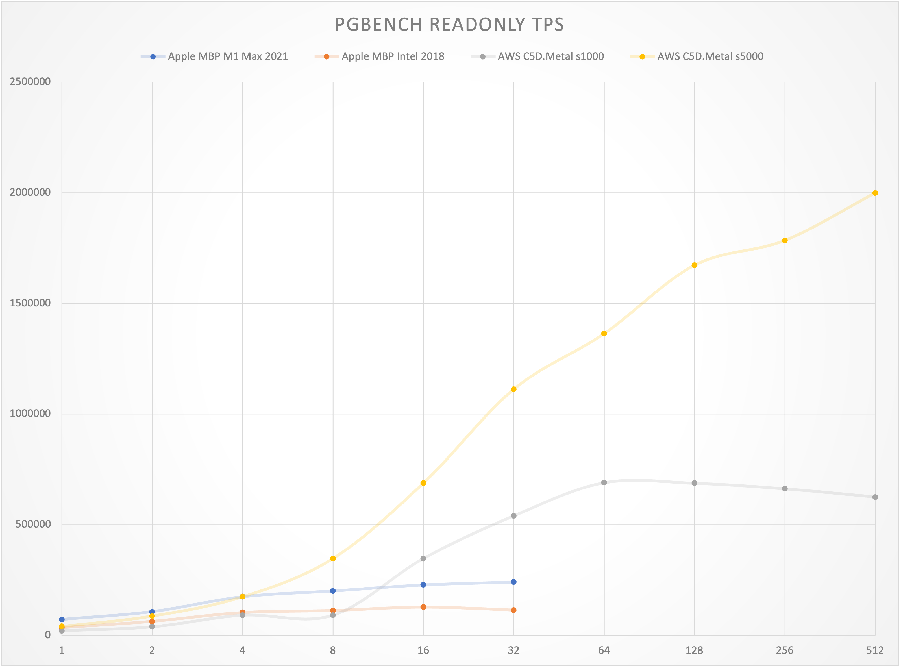
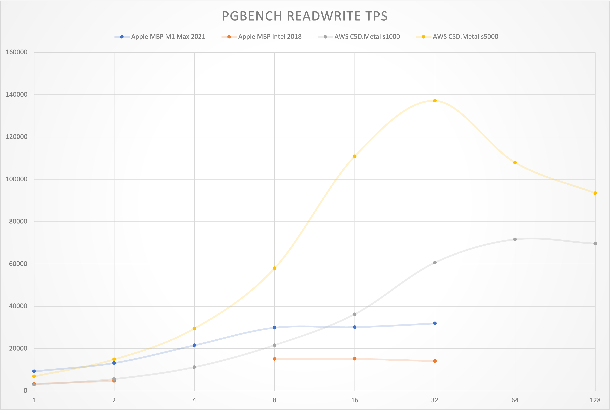

# PGBENCH BENCHMARK FOR POSTGRESQL

## Subject

|        Identity        | CPU  |    Frequency     | Database Conf | PGBENCH s=? |
| :--------------------: | ---- | :--------------: | :-----------: | :---------: |
| Apple  MBP M1 Max 2021 | 10   | 0.6GHz - 3.22GHz |    Normal     |    1000     |
| Apple  MBP Intel 2018  | 6    | 2.9GHz - 4.8GHz  |    Normal     |    1000     |
|  AWS  C5D.Metal s1000  | 96   |      3.6GHz      |    Normal     |    1000     |
|  AWS  C5D.Metal s5000  | 96   |      3.6GHz      |    Extreme    |    5000     |

Details:

* [apple-macbook](apple-macbook.md) : 2018 Intel / 2021 M1 Max
* [AWS c5d.metal.md](aws.c5d.metal.md) : Large Bare Metal 96C 192G 3.6GHz
* [AWS c5d.metal.extreme.md](aws.c5d.metal.extreme.md) : Large Bare Metal for Extreme Performance
* [AWS c5d.xlarge.md](aws.c5d.xlarge.md) : Small 4C 8G VM
* [AWS z1d.2xlarge.md](aws.z1d.2xlarge.md) : Medium 8C 64G VM

## Summary: Read Only

| RO TPS                | 1     | 2      | 4      | 8      | 16     | 32      | 64      | 128     | 256     | 512     |
| --------------------- | ----- | ------ | ------ | ------ | ------ | ------- | ------- | ------- | ------- | ------- |
| Apple MBP M1 Max 2021 | 71748 | 107309 | 174629 | 200917 | 228209 | 240841  |         |         |         |         |
| Apple MBP Intel 2018  | 34715 | 63141  | 102741 | 112033 | 127438 | 113870  |         |         |         |         |
| AWS C5D.Metal s1000   | 21583 | 39309  | 91535  | 91535  | 347259 | 540355  | 689821  | 687448  | 662552  | 625849  |
| AWS C5D.Metal s5000   | 40284 | 87247  | 174382 | 346922 | 687244 | 1111431 | 1362714 | 1671769 | 1784125 | 1998580 |

## Summary: Read Write

| RW TPS                | 1    | 2     | 4     | 8     | 16     | 32     | 64     | 128   |
| --------------------- | ---- | ----- | ----- | ----- | ------ | ------ | ------ | ----- |
| Apple MBP M1 Max 2021 | 9254 | 13201 | 21549 | 29882 | 30130  | 31903  |        |       |
| Apple MBP Intel 2018  | 3301 | 4757  |       | 15067 | 15141  | 14075  |        |       |
| AWS C5D.Metal s1000   | 2947 | 5602  | 11199 | 21607 | 36237  | 60636  | 71624  | 69629 |
| AWS C5D.Metal s5000   | 6864 | 14904 | 29481 | 57959 | 110893 | 137127 | 107960 | 93477 |

