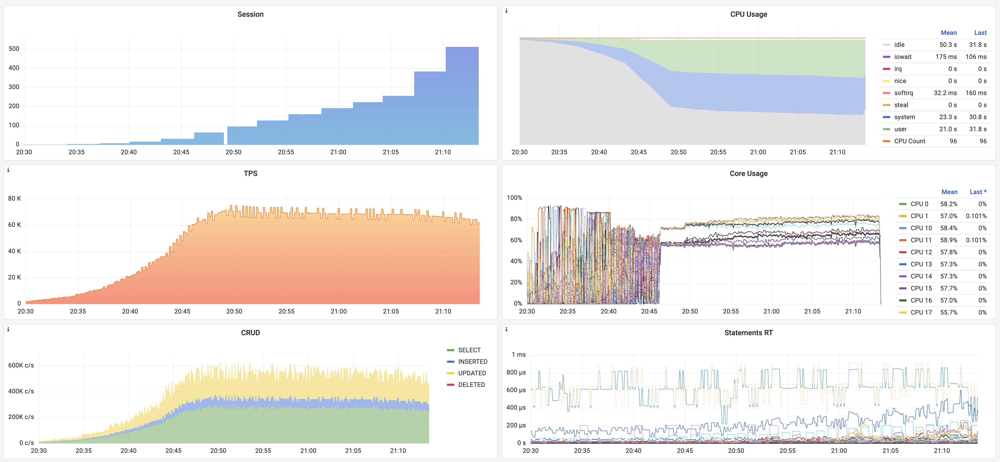
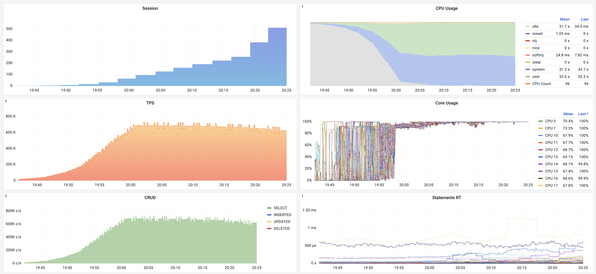

# AWS c5d.metal 96C 192G 3.6GHz

96 vCPU x 3.6 GHz , 192 GB Memory , 900GB x 4 NVME SSD

## Result

| clients \ mode | s=1000, RW | s=1000, RO |
| :------------: | :--------: | :--------: |
|       1        |    2947    |   21583    |
|       2        |    5602    |   39309    |
|       4        |   11199    |   91535    |
|       8        |   21607    |   177088   |
|       16       |   36237    |   347259   |
|       32       |   60636    |   540355   |
|       64       |   71624    |   689821   |
|       96       |   69908    |   688743   |
|      128       |   69629    |   687448   |
|      160       |   69303    |   681453   |
|      192       |   68776    |   676480   |
|      224       |   68611    |   670735   |
|      256       |   68457    |   662552   |
|      384       |   66557    |   646750   |
|      512       |   64478    |   625849   |

s1000 = 100M tuples = 16GB

Read Write : 70K TPS (c=96)



Read Only: 690K TPS (c=96)



* (ro-1)[c5d.metal/ro-1.txt]
* (ro-2)[c5d.metal/ro-2.txt]
* (ro-4)[c5d.metal/ro-4.txt]
* (ro-8)[c5d.metal/ro-8.txt]
* (ro-16)[c5d.metal/ro-16.txt]
* (ro-32)[c5d.metal/ro-32.txt]
* (ro-64)[c5d.metal/ro-64.txt]
* (ro-96)[c5d.metal/ro-96.txt]
* (ro-128)[c5d.metal/ro-128.txt]
* (ro-160)[c5d.metal/ro-160.txt]
* (ro-192)[c5d.metal/ro-192.txt]
* (ro-224)[c5d.metal/ro-224.txt]
* (ro-256)[c5d.metal/ro-256.txt]
* (ro-384)[c5d.metal/ro-384.txt]
* (ro-512)[c5d.metal/ro-512.txt]
* (rw-1)[c5d.metal/rw-1.txt]
* (rw-2)[c5d.metal/rw-2.txt]
* (rw-4)[c5d.metal/rw-4.txt]
* (rw-8)[c5d.metal/rw-8.txt]
* (rw-16)[c5d.metal/rw-16.txt]
* (rw-32)[c5d.metal/rw-32.txt]
* (rw-64)[c5d.metal/rw-64.txt]
* (rw-96)[c5d.metal/rw-96.txt]
* (rw-128)[c5d.metal/rw-128.txt]
* (rw-160)[c5d.metal/rw-160.txt]
* (rw-192)[c5d.metal/rw-192.txt]
* (rw-224)[c5d.metal/rw-224.txt]
* (rw-256)[c5d.metal/rw-256.txt]
* (rw-384)[c5d.metal/rw-384.txt]
* (rw-512)[c5d.metal/rw-512.txt]


## Prepare

**create database cluster**

```bash
bin/createpg pg-test
```


**edit-config**


```bash
pg edit-config
max_connections : 800
shared_buffers : 32GB
work_mem : 64MB
autovacuum : false
full_page_writes : false
```

**run bench**

```bash
export RES=/tmp/pgbench
export PGURL="test"
mkdir -p ${RES}
for i in {1..128}; do
  echo "${i} clients"
  pgbench -nv --select-only -j ${i} -c ${i} -T 30 -r -P 1  ${PGURL}  > ${RES}/ro-${i}.txt
done

pgbench -nv --select-only -j 1   -c 1   -T 15 -r -P 1  ${PGURL}  > ${RES}/ro-1.txt   
pgbench -nv --select-only -j 2   -c 2   -T 15 -r -P 1  ${PGURL}  > ${RES}/ro-2.txt   
pgbench -nv --select-only -j 4   -c 4   -T 15 -r -P 1  ${PGURL}  > ${RES}/ro-4.txt   
pgbench -nv --select-only -j 8   -c 8   -T 15 -r -P 1  ${PGURL}  > ${RES}/ro-8.txt   
pgbench -nv --select-only -j 16  -c 16  -T 15 -r -P 1  ${PGURL}  > ${RES}/ro-16.txt  
pgbench -nv --select-only -j 32  -c 32  -T 15 -r -P 1  ${PGURL}  > ${RES}/ro-32.txt  
pgbench -nv --select-only -j 64  -c 64  -T 15 -r -P 1  ${PGURL}  > ${RES}/ro-64.txt  
pgbench -nv --select-only -j 96  -c 96  -T 15 -r -P 1  ${PGURL}  > ${RES}/ro-96.txt  
pgbench -nv --select-only -j 128 -c 128 -T 15 -r -P 1  ${PGURL}  > ${RES}/ro-128.txt 
pgbench -nv --select-only -j 160 -c 160 -T 15 -r -P 1  ${PGURL}  > ${RES}/ro-160.txt 
pgbench -nv --select-only -j 192 -c 192 -T 15 -r -P 1  ${PGURL}  > ${RES}/ro-192.txt 
pgbench -nv --select-only -j 224 -c 224 -T 15 -r -P 1  ${PGURL}  > ${RES}/ro-224.txt 
pgbench -nv --select-only -j 256 -c 256 -T 15 -r -P 1  ${PGURL}  > ${RES}/ro-256.txt 
pgbench -nv --select-only -j 384 -c 384 -T 15 -r -P 1  ${PGURL}  > ${RES}/ro-384.txt
pgbench -nv --select-only -j 512 -c 512 -T 15 -r -P 1  ${PGURL}  > ${RES}/ro-512.txt
```

http://52.83.42.158:3000/d/wPbb-UiVk/pgsql-bench?orgId=1&from=1660736400000&to=1660739100000


```bash
# Read Write Queries
export RES=/tmp/pgbench
export PGURL="test"
mkdir -p ${RES}
pgbench -j 1   -c 1   -T 180 -r -P 10  ${PGURL}  > ${RES}/rw-1.txt   
pgbench -j 2   -c 2   -T 180 -r -P 10  ${PGURL}  > ${RES}/rw-2.txt   
pgbench -j 4   -c 4   -T 180 -r -P 10  ${PGURL}  > ${RES}/rw-4.txt   
pgbench -j 8   -c 8   -T 180 -r -P 10  ${PGURL}  > ${RES}/rw-8.txt   
pgbench -j 16  -c 16  -T 180 -r -P 10  ${PGURL}  > ${RES}/rw-16.txt  
pgbench -j 32  -c 32  -T 180 -r -P 10  ${PGURL}  > ${RES}/rw-32.txt  
pgbench -j 64  -c 64  -T 180 -r -P 10  ${PGURL}  > ${RES}/rw-64.txt  
pgbench -j 96  -c 96  -T 180 -r -P 10  ${PGURL}  > ${RES}/rw-96.txt  
pgbench -j 128 -c 128 -T 180 -r -P 10  ${PGURL}  > ${RES}/rw-128.txt 
pgbench -j 160 -c 160 -T 180 -r -P 10  ${PGURL}  > ${RES}/rw-160.txt 
pgbench -j 192 -c 192 -T 180 -r -P 10  ${PGURL}  > ${RES}/rw-192.txt 
pgbench -j 224 -c 224 -T 180 -r -P 10  ${PGURL}  > ${RES}/rw-224.txt 
pgbench -j 256 -c 256 -T 180 -r -P 10  ${PGURL}  > ${RES}/rw-256.txt 
pgbench -j 384 -c 384 -T 180 -r -P 10  ${PGURL}  > ${RES}/rw-384.txt
pgbench -j 512 -c 512 -T 180 -r -P 10  ${PGURL}  > ${RES}/rw-512.txt 
```


