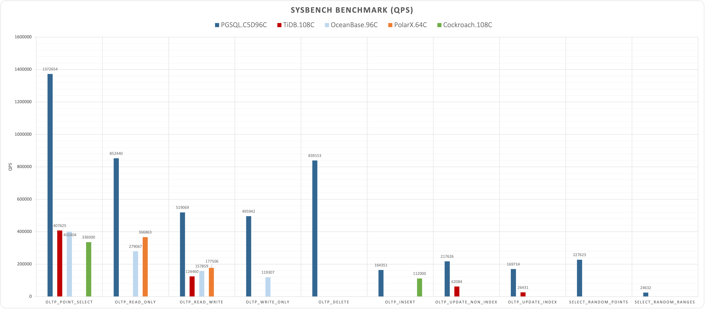
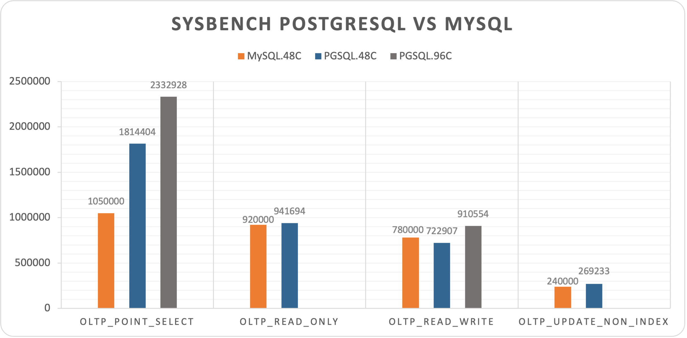

# PostgreSQL SYSBENCH Performence

## Summary

|       Database        | PGSQL.C5D96C |                    TiDB.108C                     |                OceanBase.96C                | PolarX.64C | Comment |
| :-------------------: | :----------: | :----------------------------------------------: | :-----------------------------------------: | :--------: | :-----: |
|   oltp_point_select   |   1372654    |                      407625                      |                   401404                    |            |         |
|    oltp_read_only     |    852440    |                                                  |                   279067                    |   366863   | 16x TPS |
|    oltp_read_write    |    519069    |                      124460                      |                   157859                    |   177506   | 20x TPS |
|    oltp_write_only    |    495942    |                                                  |                   119307                    |            | 6x TPS  |
|      oltp_delete      |    839153    |                                                  |                                             |            |         |
|      oltp_insert      |    164351    |                                                  |                                             |            |         |
| oltp_update_non_index |    217626    |                      62084                       |                                             |            |         |
|   oltp_update_index   |    169714    |                      26431                       |                                             |            |         |
| select_random_points  |    227623    |                                                  |                                             |            |         |
| select_random_ranges  |    24632     |                                                  |                                             |            |         |
|        Machine        |  c5d.metal   | m5.xlarge x3     i3.4xlarge x3     c5.4xlarge x3 | ecs.hfg7.8xlarge x3     ecs.hfg7.8xlarge x1 | Enterprise |         |
|         Spec          |   96C 192G   |                    108C 510G                     |                  96C 384G                   |  64C 256G  |         |

### OLTP Overview: PGSQL vs MySQL

* [AWS c5d.metal (NORMAL)](aws.c5d.metal.normal.md)
* [Reference: TiDB 6.1](ref-tidb6.md)
* [Reference: OceanBase 3.1](ref-oceanbase3.md)
* [Reference: PolarDB-X](ref-polardbx.md)

### Sysbench: PGSQL vs MySQL

* [Reference: MySQL](ref-mysql.md)
* [AWS c5d.metal (EXTREME)](aws.c5d.metal.extreme.md)

### OLTP Point Select: PGSQL vs MySQL 

* [AWS c5d.metal (EXTREME)](aws.c5d.metal.extreme.md)

## Details

* [Apple 2021 M1 Max](apple-m1-max.md)
* [AWS c5d.metal (NORMAL)](aws.c5d.metal.normal.md)
* [AWS c5d.metal (EXTREME)](aws.c5d.metal.extreme.md)
* [Reference: TiDB 6.1](ref-tidb6.md)
* [Reference: OceanBase 3.1](ref-oceanbase3.md)
* [Reference: MySQL](ref-mysql.md)
* [Reference: PolarDB-X](ref-polardbx.md)
