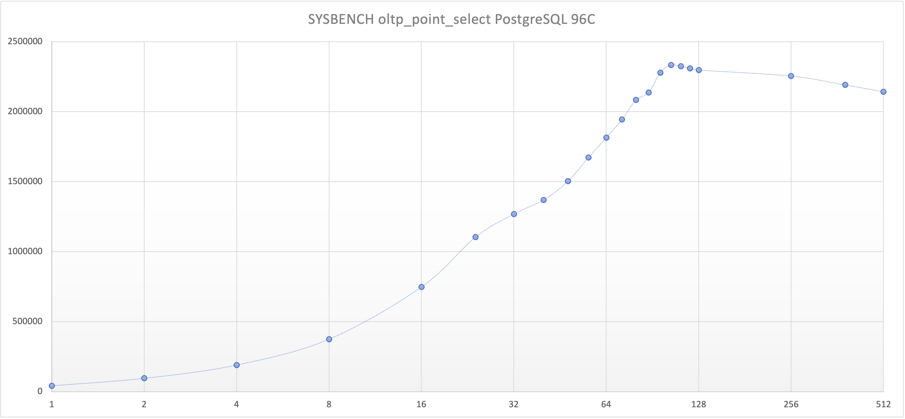
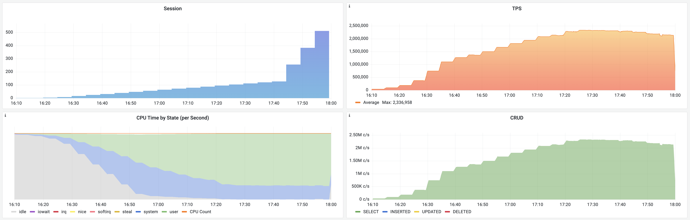

# Reference MySQL Rouge Test

DAMN, MySQL publish a **shameless** benchmark result based on MySQL 8.0

https://www.mysql.com/cn/why-mysql/benchmarks/mysql/

It just turns off checksum, double write, binlog, PFS, and fsync and use latin-1 charset. 

Which makes it a toy and impossible to use in real-world production environment.

http://dimitrik.free.fr/blog/posts/mysql-performance-80-and-sysbench-oltp_rw-updatenokey.html 

**But we can do it to postgres too and see how far it goes.**

## MySQL Performence

|       TestCase        |   TPS   |         Scale          |                            Source                            |
| :-------------------: | :-----: | :--------------------: | :----------------------------------------------------------: |
|   oltp_point_select   | 1050000 | 50 M Tuples x 8 Tables | [Source 1](http://dimitrik.free.fr/blog/posts/mysql-performance-1m-iobound-qps-with-80-ga-on-intel-optane-ssd.html) |
|    oltp_read_only     | 920000  | 10 M Tuples x 8 Tables | [Source 2](http://dimitrik.free.fr/blog/posts/mysql-performance-80-and-sysbench-oltp_rw-updatenokey.html) |
|    oltp_read_write    | 500000  | 10 M Tuples x 8 Tables |                           Source2                            |
| oltp_update_non_index | 240000  | 10 M Tuples x 8 Tables |                           Source2                            |

## Compare

|       Database        |             MySQL.48C             |         PGSQL.48C          |         PGSQL.96C          |
| :-------------------: | :-------------------------------: | :------------------------: | :------------------------: |
|   oltp_point_select   |              1050000              |          1814404           |          2332928           |
|    oltp_read_only     |              920000               |           941694           |                            |
|    oltp_read_write    |              500000               |           722907           |           910554           |
| oltp_update_non_index |              240000               |           269233           |                            |
|          CPU          |            48C 2.7GHz             |         96C 3.6GHz         |         96C 3.6GHz         |
|          Mem          |              172 GB               |           192 GB           |           192 GB           |
|        Storage        | Intel Optane SSD P4800X Series x2 | EPHEMERAL NVME SSD 900G x4 | EPHEMERAL NVME SSD 900G x4 |
|     Configuration     |     Shameless Extreme Config      |  Shameless Extreme Config  |  Shameless Extreme Config  |
|        Comment        |                                   |        Force c = 48        |                            |

## Point Select Performance Compare

### MySQL

### PgSQL

### Raw Data

|  c  |   qps   |
|:---:|:-------:|
|  1  |  42227  |
|  2  |  96009  |
|  4  | 190711  |
|  8  | 375050  |
| 16  | 748081  |
| 24  | 1104704 |
| 32  | 1269137 |
| 40  | 1370115 |
| 48  | 1503656 |
| 56  | 1672842 |
| 64  | 1814404 |
| 72  | 1944281 |
| 80  | 2083453 |
| 88  | 2137042 |
| 96  | 2279107 |
| 104 | 2332928 |
| 112 | 2324248 |
| 120 | 2309965 |
| 128 | 2297587 |
| 256 | 2254737 |
| 384 | 2190990 |
| 512 | 2142912 |

