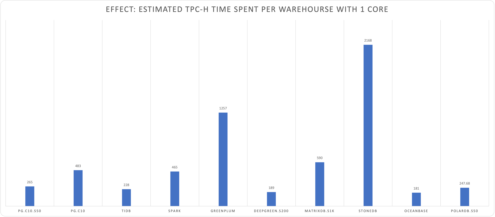

# TPC-H for PostgreSQL

* [Test Method](METHOD.md)

## Result Summary

| Scale Factor | Time (s) | CPU  | Environment |    Comment    |
| :----------: | :------: | :--: | :---------: | :-----------: |
|      1       |    8     |  10  | 10C  / 64G  | apple  m1 max |
|      10      |    56    |  10  | 10C  / 64G  | apple  m1 max |
|      50      |   1327   |  10  | 10C  / 64G  | apple  m1 max |
|     100      |   4835   |  10  | 10C  / 64G  | apple  m1 max |
|      1       |  13.51   |  8   |  8C  / 64G  |  z1d.2xlarge  |
|      10      |  133.35  |  8   |  8C  / 64G  |  z1d.2xlarge  |

### Comparison

Effect = Estimated TPC-H Time spent completing 1 Warehouse using 1 Core.  (Lower is better)

Effect = Time / Scale Factor * CPU

| Database   | SF   | Time (s) | CPU  | Environment   | Comment       | Source                                                       | Effect |
| ---------- | ---- | -------- | ---- | ------------- | ------------- | ------------------------------------------------------------ | ------ |
| PostgreSQL | 1    | 8        | 10   | 10C  / 64G    | apple  m1 max | [Vonng](https://github.com/Vonng/pgtpc/tree/master/tpch)     | 80     |
| PostgreSQL | 10   | 56       | 10   | 10C  / 64G    | apple  m1 max | [Vonng](https://github.com/Vonng/pgtpc/tree/master/tpch)     | 56     |
| PostgreSQL | 50   | 1327     | 10   | 10C  / 64G    | apple  m1 max | [Vonng](https://github.com/Vonng/pgtpc/tree/master/tpch)     | 265    |
| PostgreSQL | 100  | 4835     | 10   | 10C  / 64G    | apple  m1 max | [Vonng](https://github.com/Vonng/pgtpc/tree/master/tpch)     | 484    |
| PostgreSQL | 1    | 13.51    | 8    | 8C  / 64G     | z1d.2xlarge   | [Vonng](https://github.com/Vonng/pgtpc/tree/master/tpch)     | 108    |
| PostgreSQL | 10   | 133.35   | 8    | 8C  / 64G     | z1d.2xlarge   | [Vonng](https://github.com/Vonng/pgtpc/tree/master/tpch)     | 107    |
| TiDB       | 100  | 190      | 120  | 120C  / 570G  |               | [TiDB](https://docs.pingcap.com/zh/tidb/v5.2/v5.2-performance-benchmarking-with-tpch) | 228    |
| Spark      | 100  | 388      | 120  | 120C  / 570G  |               | [TiDB](https://docs.pingcap.com/zh/tidb/v5.2/v5.2-performance-benchmarking-with-tpch) | 466    |
| Greenplum  | 100  | 436      | 288  | 120C  / 570G  |               | [TiDB](https://docs.pingcap.com/zh/tidb/v5.2/v5.2-performance-benchmarking-with-tpch) | 1256   |
| DeepGreen  | 200  | 148      | 256  | 288C  / 1152G |               | [Digoal](https://billtian.github.io/digoal.blog/2018/09/03/02.html) | 189    |
| MatrixDB   | 1000 | 2306     | 256  | 256C  / 1024G |               | [MXDB](https://cloud.tencent.com/developer/article/1997622)  | 590    |
| Hive       | 1000 | 59599    | 256  | 256C  / 1024G |               | [MXDB](https://cloud.tencent.com/developer/article/1997622)  | 15257  |
| StoneDB    | 100  | 3388     | 64   | 64C  / 128G   |               | [StoneDB](https://stonedb.io/docs/performance-tuning/performance-tests/OLAP/tcph-test-report) | 2168   |
| ClickHouse | 100  | 11537    | 64   | 64C  / 128G   |               | [StoneDB](https://stonedb.io/docs/performance-tuning/performance-tests/OLAP/tcph-test-report) | 7384   |
| OceanBase  | 100  | 189      | 96   | 96C  / 384G   |               | [OceanBase](https://open.oceanbase.com/docs/community/oceanbase-database/V3.1.0/wtu4kv) | 181    |
| PolarDB    | 50   | 387      | 32   | 32C  / 128G   |               | [Aliyun](https://static-aliyun-doc.oss-cn-hangzhou.aliyuncs.com/download%2Fpdf%2F59748%2F%E6%80%A7%E8%83%BD%E7%99%BD%E7%9A%AE%E4%B9%A6_cn_zh-CN.pdf) | 248    |
| PolarDB    | 50   | 755      | 16   | 16C  / 64G    |               | [Aliyun](https://static-aliyun-doc.oss-cn-hangzhou.aliyuncs.com/download%2Fpdf%2F59748%2F%E6%80%A7%E8%83%BD%E7%99%BD%E7%9A%AE%E4%B9%A6_cn_zh-CN.pdf) | 242    |

